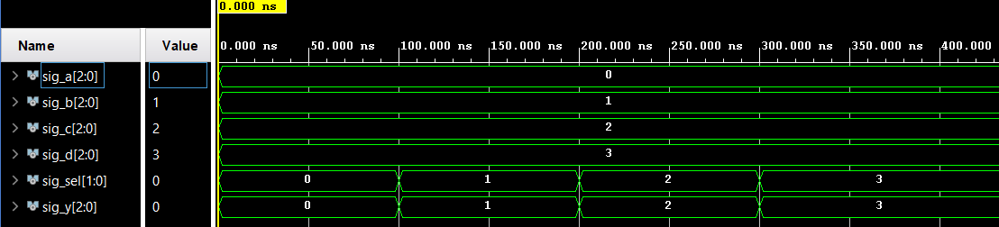

# Lab 3: Vojtěch Kuchař

### Three-bit wide 4-to-1 multiplexer

1. Listing of VHDL architecture from source file `mux_3bit_4to1.vhd`. Always use syntax highlighting, meaningful comments, and follow VHDL guidelines:

```vhdl
architecture Behavioral of mux_3bit_4to1 is
begin

    y_o <= a_i when (sel = "00") else
           b_i when (sel = "01") else
           c_i when (sel = "10") else
           d_i;
       
end architecture Behavioral;
```

2. Screenshot with simulated time waveforms. Always display all inputs and outputs (display the inputs at the top of the image, the outputs below them) at the appropriate time scale!

   

3. Listing of pin assignments for the Nexys A7 board in `nexys-a7-50t.xdc`. **DO NOT list** the whole file, just your switch and LED settings.

```shell
##Switches
set_property -dict { PACKAGE_PIN J15   IOSTANDARD LVCMOS33 } [get_ports { a_i[0] }]; #IO_L24N_T3_RS0_15 Sch=sw[0]
set_property -dict { PACKAGE_PIN R15   IOSTANDARD LVCMOS33 } [get_ports { b_i[0] }]; #IO_L13N_T2_MRCC_14 Sch=sw[3]
set_property -dict { PACKAGE_PIN U18   IOSTANDARD LVCMOS33 } [get_ports { c_i[0] }]; #IO_L17N_T2_A13_D29_14 Sch=sw[6]
set_property -dict { PACKAGE_PIN U8    IOSTANDARD LVCMOS18 } [get_ports { d_i[0] }]; #IO_25_34 Sch=sw[9]
set_property -dict { PACKAGE_PIN U12   IOSTANDARD LVCMOS33 } [get_ports { y[0] }]; #IO_L20P_T3_A08_D24_14 Sch=sw[13]
set_property -dict { PACKAGE_PIN U11   IOSTANDARD LVCMOS33 } [get_ports { sel[1] }]; #IO_L19N_T3_A09_D25_VREF_14 Sch=sw[14]
set_property -dict { PACKAGE_PIN V10   IOSTANDARD LVCMOS33 } [get_ports { sel[0] }]; #IO_L21P_T3_DQS_14 Sch=sw[15]
...
## LEDs
set_property -dict { PACKAGE_PIN H17   IOSTANDARD LVCMOS33 } [get_ports { sig_a }]; #IO_L18P_T2_A24_15 Sch=led[0]
set_property -dict { PACKAGE_PIN K15   IOSTANDARD LVCMOS33 } [get_ports { sig_b }]; #IO_L24P_T3_RS1_15 Sch=led[1]
set_property -dict { PACKAGE_PIN J13   IOSTANDARD LVCMOS33 } [get_ports { sig_c }]; #IO_L17N_T2_A25_15 Sch=led[2]
set_property -dict { PACKAGE_PIN N14   IOSTANDARD LVCMOS33 } [get_ports { sig_d }]; #IO_L8P_T1_D11_14 Sch=led[3]
...
```
